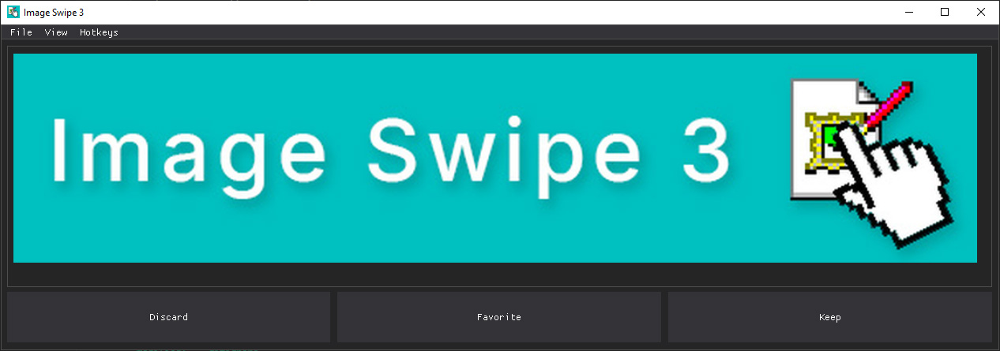

# Image Swipe 3



>
> Let the user sort 'em out.
>

- [Image Swipe 3](#image-swipe-3)
  - [What is It?](#what-is-it)
  - [Install](#install)
  - [Usage](#usage)
    - [Built-In Implementations](#built-in-implementations)
    - [Addon Implementations](#addon-implementations)
      - [Installing Addons](#installing-addons)
      - [Creating Your Own](#creating-your-own)

---

## What is It?

A GUI tool for rapid sorting of images from local and networked sources.

If you're someone that works with large sets of images like a photographer, archivist, or otherwise, this tool provides the functionality to sort, categorize, and manage through a simple graphical interface.
Both local and networked systems are supported [out of the box](#built-in-implementations).
For any specific endpoints not officially supported, [addons](#addon-implementations) can be made for any unique use case.

See [Built-In Implementations](#built-in-implementations) for a list of currently implemented functionality.
Additional functionality can be added through [addons](#addon-implementations).

## Install

To set up the project, follow these steps:

1. **Clone the repository**:
    ```sh
    git clone https://github.com/yourusername/your-repo.git
    cd your-repo
    ```
2. **Create a virtual environment**:
    ```sh
    python -m venv .venv --prompt IS3
    ```
3. **Activate the virtual environment**:
    - **Windows**:
        ```sh
        .venv\Scripts\activate
        ```
    - **Linux/Mac**:
        ```sh
        source .venv/bin/activate
        ```
4. **Install the dependencies**:
    ```sh
    pip install -r requirements.txt
    ```
5. **View the program's commands**:
    ```sh
    python start.py -h
    ```

## Usage

### Built-In Implementations

| Command | Description |
|---|---|
| `local` | Utility for choosing between keeping, favoriting, or discarding any number of local images. |
| `localmulti` | Utility for choosing between two or more images or discarding them all for any number of local images. |
| `pickn` | Utility for choosing any number of images from a set of local images in repeating rounds until only the desired number, or less, of images remain. |
| `reddit` | Proof of concept for viewing the images of any subreddit while allowing you to download or discard each in a sequential process. |

### Addon Implementations

#### Installing Addons

1. Add your desired addon's `Swipe***.py` file to the [addons/](addons/) directory like so:
    ```
    Image Swipe 3
    └── addons
        └── Swipe***.py
    ```

#### Creating Your Own

Additional implementations extending [SwiperImplementation](src/implementations/SwiperImplementation.py) can be added to the [addons/](addons/) directory and will be automatically loaded when `start.py` is run.

An example of the most basic structure of an addon can be found in the [SwipeAddonDemo](addons/SwipeAddonDemo.py) file.

Additional specifics on feature implementation and usage can found in the [SwipeLocal](src/implementations/SwipeLocal.py) and [SwipeLocalMulti](src/implementations/SwipeLocalMulti.py) source files.
`SwipeLocal` being a base level implementation and `SwipeLocalMulti` being an extension of `SwipeLocal` itself.

For an example of networked and paginated implementation, check the [SwipeReddit](src\implementations\SwipeReddit.py) source file.

The buttons shown in the GUI and the hotkeys available can also be modified per implementation.
